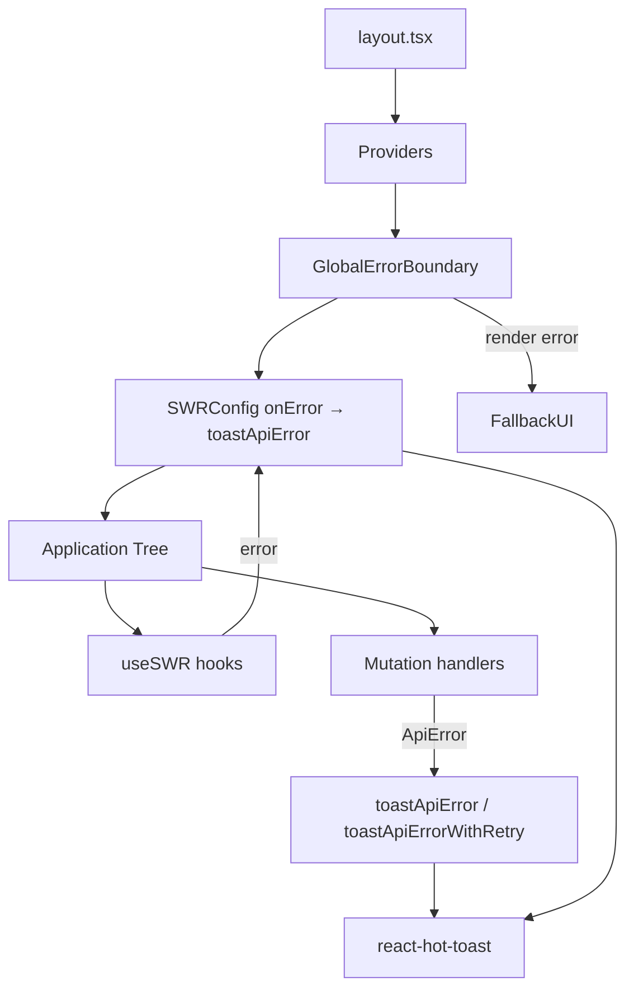

# Design Document

## Feature: Global Error Boundary & Toast Standardization

---

## Overview

This feature introduces two complementary improvements to the FluxaPay frontend:

1. **Global Error Boundary** — a React class component that wraps the entire application tree and catches unhandled render errors, presenting a recoverable fallback UI instead of a blank crash screen.
2. **Centralized Toast Utility** — a module that maps `ApiError` status codes to consistent, human-readable toast messages, eliminating scattered `toast.error` call sites with hardcoded strings.

These two concerns are unified through the `Providers` component, which will host both the `SWRConfig` global error handler (delegating to the toast utility) and the error boundary wrapper.

The result is a layered error-handling architecture:
- **Render errors** → caught by `GlobalErrorBoundary`, shown as fallback UI
- **Data-fetching errors** (SWR) → caught by `SWRConfig.onError`, shown as standardized toasts
- **Mutation/form errors** → caught at call sites, shown via `toastApiError` / `toastApiErrorWithRetry`

---

## Architecture



**Layered error flow:**

1. `layout.tsx` renders `<Providers>` which wraps children in `GlobalErrorBoundary` then `SWRConfig`.
2. Render-time JS errors bubble up to `GlobalErrorBoundary.componentDidCatch`, which logs and renders `FallbackUI`.
3. SWR fetch errors are intercepted by the global `onError` callback, which calls `toastApiError`.
4. Mutation/form handlers catch errors explicitly and call `toastApiError` or `toastApiErrorWithRetry`.
5. All toast output flows through `react-hot-toast` (already mounted in `layout.tsx`).

---

## Components and Interfaces

### `GlobalErrorBoundary` (`src/components/GlobalErrorBoundary.tsx`)

A React class component (required for `componentDidCatch`).

```typescript
interface Props {
  children: React.ReactNode;
}

interface State {
  hasError: boolean;
  error: Error | null;
}

class GlobalErrorBoundary extends React.Component<Props, State> {
  static getDerivedStateFromError(error: Error): State
  componentDidCatch(error: Error, info: React.ErrorInfo): void  // calls console.error
  handleReset(): void  // resets state to { hasError: false, error: null }
  render(): React.ReactNode  // renders FallbackUI or children
}
```

**FallbackUI** is rendered inline within `GlobalErrorBoundary.render()` — no separate file needed. It displays:
- A heading: "Something went wrong"
- A brief message: "An unexpected error occurred. You can try refreshing the page."
- A "Try again" button that calls `handleReset()`

### `toastApiError` / `toastApiErrorWithRetry` (`src/lib/toastApiError.ts`)

```typescript
// Maps ApiError status codes to human-readable messages and fires toast.error
export function toastApiError(error: unknown): void

// Same mapping, but for retryable statuses (429, 5xx) renders a toast with a Retry button
export function toastApiErrorWithRetry(error: unknown, onRetry: () => void): void
```

Status → message mapping:

| Status | Message |
|--------|---------|
| 401 | "Session expired. Please sign in again." |
| 403 | "You do not have permission to perform this action." |
| 404 | "The requested resource was not found." |
| 429 | "Too many requests. Please wait a moment and try again." |
| ≥ 500 | "A server error occurred. Please try again later." |
| other `ApiError` | `error.message` (passthrough) |
| non-`ApiError` | "An unexpected error occurred." |

Retryable statuses (429, ≥500) and non-`ApiError` values get a "Retry" button in `toastApiErrorWithRetry`. Non-retryable statuses (401, 403, 404) fall back to a plain `toast.error`.

### Updated `Providers` (`src/app/providers.tsx`)

```typescript
"use client";

export function Providers({ children }: { children: ReactNode }) {
  return (
    <GlobalErrorBoundary>
      <SWRConfig value={{ onError: (error) => toastApiError(error) }}>
        {children}
      </SWRConfig>
    </GlobalErrorBoundary>
  );
}
```

SWR's default error state is preserved — `onError` only fires the toast side-effect; it does not suppress the error from `useSWR`'s returned `error` field.

---

## Data Models

### Error Boundary State

```typescript
interface ErrorBoundaryState {
  hasError: boolean;   // true when an error has been caught
  error: Error | null; // the caught error, for logging/display
}
```

Initial state: `{ hasError: false, error: null }`.  
Reset (via "Try again"): state returns to initial, causing children to remount.

### ApiError (existing, `src/lib/api.ts`)

```typescript
class ApiError extends Error {
  status: number;   // HTTP status code
  message: string;  // Error message from API response body
}
```

The toast utility uses `instanceof ApiError` to distinguish API errors from generic `Error` or unknown thrown values.

### Toast Message Resolution

```typescript
type ToastMessage = string;

function resolveMessage(error: unknown): ToastMessage {
  if (!(error instanceof ApiError)) return "An unexpected error occurred.";
  switch (true) {
    case error.status === 401: return "Session expired. Please sign in again.";
    case error.status === 403: return "You do not have permission to perform this action.";
    case error.status === 404: return "The requested resource was not found.";
    case error.status === 429: return "Too many requests. Please wait a moment and try again.";
    case error.status >= 500:  return "A server error occurred. Please try again later.";
    default:                   return error.message;
  }
}
```

### Retry Toast JSX (react-hot-toast custom render)

`toastApiErrorWithRetry` uses `toast.error` with a custom render function for retryable errors:

```typescript
toast.error(
  (t) => (
    <span>
      {message}
      <button onClick={() => { onRetry(); toast.dismiss(t.id); }}>Retry</button>
    </span>
  )
);
```

For non-retryable errors it falls back to `toast.error(message)`.


---

## Correctness Properties

*A property is a characteristic or behavior that should hold true across all valid executions of a system — essentially, a formal statement about what the system should do. Properties serve as the bridge between human-readable specifications and machine-verifiable correctness guarantees.*

### Property 1: Error boundary catches any render error

*For any* React component that throws a JavaScript error during rendering, when wrapped in `GlobalErrorBoundary`, the boundary SHALL render the fallback UI (containing "Something went wrong") rather than propagating the crash to the parent tree.

**Validates: Requirements 1.2**

---

### Property 2: Error boundary is transparent when no error occurs

*For any* valid React children, when rendered inside `GlobalErrorBoundary` with no error thrown, the boundary SHALL render those children unchanged and not inject any additional DOM nodes.

**Validates: Requirements 1.7**

---

### Property 3: Defined status codes map to exact messages

*For any* `ApiError` instance whose `status` is one of the defined codes (401, 403, 404, 429, or any value ≥ 500), calling `toastApiError` SHALL invoke `toast.error` with exactly the corresponding mapped message string and no other message.

**Validates: Requirements 2.2, 2.3, 2.4, 2.5, 2.6, 6.1**

---

### Property 4: Unmapped ApiError status falls through to error.message

*For any* `ApiError` instance whose `status` is not in the defined mapping set (i.e., not 401, 403, 404, 429, and less than 500), calling `toastApiError` SHALL invoke `toast.error` with a message equal to the `ApiError`'s own `message` property.

**Validates: Requirements 2.7, 6.2**

---

### Property 5: Non-ApiError values produce the generic fallback message

*For any* value that is not an instance of `ApiError` (including plain `Error` objects, strings, numbers, `null`, `undefined`, or arbitrary objects), calling `toastApiError` SHALL invoke `toast.error` with the message "An unexpected error occurred."

**Validates: Requirements 2.8**

---

### Property 6: Retry button presence matches retryability of the error

*For any* error value passed to `toastApiErrorWithRetry`:
- If the error is an `ApiError` with status 429 or ≥ 500, or is a non-`ApiError` value, the rendered toast SHALL include a "Retry" button.
- If the error is an `ApiError` with status 401, 403, or 404, the rendered toast SHALL NOT include a "Retry" button.

**Validates: Requirements 3.2, 3.4, 3.5**

---

### Property 7: Each toastApiError call produces an independent toast

*For any* error value, calling `toastApiError` N times in sequence SHALL result in `toast.error` being called exactly N times — each invocation is an independent notification event and prior calls do not suppress subsequent ones.

**Validates: Requirements 6.3**

---

## Error Handling

### Render Errors (Error Boundary)

- `GlobalErrorBoundary.componentDidCatch` logs via `console.error(error, info)` for observability.
- The fallback UI is minimal and always renderable — it has no external dependencies that could themselves throw.
- Clicking "Try again" calls `setState({ hasError: false, error: null })`, which causes React to remount the child tree. If the underlying error was transient (e.g., a race condition), the remount may succeed.
- If the child tree throws again after reset, the boundary catches it again and re-displays the fallback.

### API / Fetch Errors (Toast Utility)

- `toastApiError` is designed to never throw — it wraps all logic in a try/catch internally so a broken error handler cannot itself crash the app.
- The `instanceof ApiError` check is the sole branching mechanism; no duck-typing is used to avoid false positives.
- For `toastApiErrorWithRetry`, the `onRetry` callback is invoked inside the toast's button `onClick`. If `onRetry` throws, the error will propagate to the React event handler (not silently swallowed), which is the correct behavior.

### SWR Integration

- The `SWRConfig.onError` handler only calls `toastApiError` — it does not call `event.preventDefault()` or return a value that would suppress SWR's internal error state. Components using `useSWR` can still read the `error` field and render inline error states if needed.
- Network errors (e.g., `TypeError: Failed to fetch`) are non-`ApiError` values and will display "An unexpected error occurred." via the fallback branch.

---

## Testing Strategy

### Dual Testing Approach

Both unit tests and property-based tests are required. They are complementary:
- **Unit tests** cover specific examples, integration points, and interaction flows.
- **Property tests** verify universal rules across many generated inputs, catching edge cases that hand-written examples miss.

### Property-Based Testing Library

Use **`fast-check`** (already compatible with Vitest). Install as a dev dependency:

```bash
npm install --save-dev fast-check
```

Each property test must run a minimum of **100 iterations** (fast-check default is 100; set explicitly via `{ numRuns: 100 }`).

Tag format for each property test:
```
// Feature: global-error-boundary-toast-standardization, Property N: <property_text>
```

### Unit Tests (Examples & Integration)

File: `src/components/__tests__/GlobalErrorBoundary.test.tsx`

- **Example 1.1**: Render `<Providers><div>child</div></Providers>` and assert `GlobalErrorBoundary` is an ancestor (via component tree inspection or snapshot).
- **Example 1.3**: Throw from a child; assert fallback contains "Something went wrong".
- **Example 1.4+1.5**: Throw from a child; click "Try again"; assert children remount (original content visible again).
- **Example 1.6**: Throw from a child; assert `console.error` was called with the error and component stack.

File: `src/lib/__tests__/toastApiError.test.ts`

- **Example 2.1**: Assert `toastApiError` is exported and callable.
- **Example 3.1**: Assert `toastApiErrorWithRetry` is exported and callable.
- **Example 3.3**: Call `toastApiErrorWithRetry` with a 500 error; render the toast; click "Retry"; assert `onRetry` was called and `toast.dismiss` was called.

File: `src/app/__tests__/providers.test.tsx`

- **Example 4.1**: Render `<Providers>` and assert `SWRConfig` is present with an `onError` prop.
- **Example 4.2**: Trigger the `onError` callback; assert `toastApiError` was called with the same error.
- **Example 4.3**: Trigger a SWR fetch error; assert the `error` field from `useSWR` is still populated after the toast fires.

### Property-Based Tests

File: `src/lib/__tests__/toastApiError.property.test.ts`

```typescript
// Feature: global-error-boundary-toast-standardization, Property 1: Error boundary catches any render error
it('catches any render error and shows fallback', () => {
  fc.assert(fc.property(fc.string(), (msg) => {
    // throw Error(msg) from child, assert fallback UI rendered
  }), { numRuns: 100 });
});

// Feature: global-error-boundary-toast-standardization, Property 2: Error boundary is transparent when no error occurs
it('renders children unchanged when no error', () => {
  fc.assert(fc.property(fc.string(), (content) => {
    // render content as child, assert it appears in output
  }), { numRuns: 100 });
});

// Feature: global-error-boundary-toast-standardization, Property 3: Defined status codes map to exact messages
it('maps defined status codes to exact messages', () => {
  const defined = [
    [401, 'Session expired. Please sign in again.'],
    [403, 'You do not have permission to perform this action.'],
    [404, 'The requested resource was not found.'],
    [429, 'Too many requests. Please wait a moment and try again.'],
  ];
  fc.assert(fc.property(fc.integer({ min: 500, max: 599 }), (status) => {
    // verify >= 500 maps to server error message
  }), { numRuns: 100 });
  // plus example assertions for each defined code
});

// Feature: global-error-boundary-toast-standardization, Property 4: Unmapped ApiError status falls through to error.message
it('passes through message for unmapped ApiError statuses', () => {
  fc.assert(fc.property(
    fc.integer({ min: 100, max: 499 }).filter(s => ![401,403,404,429].includes(s)),
    fc.string({ minLength: 1 }),
    (status, message) => {
      // toastApiError(new ApiError(status, message)) → toast.error called with message
    }
  ), { numRuns: 100 });
});

// Feature: global-error-boundary-toast-standardization, Property 5: Non-ApiError values produce the generic fallback message
it('shows generic message for non-ApiError values', () => {
  fc.assert(fc.property(
    fc.oneof(fc.string(), fc.integer(), fc.boolean(), fc.constant(null), fc.constant(undefined)),
    (value) => {
      // toastApiError(value) → toast.error called with "An unexpected error occurred."
    }
  ), { numRuns: 100 });
});

// Feature: global-error-boundary-toast-standardization, Property 6: Retry button presence matches retryability
it('shows retry button only for retryable errors', () => {
  fc.assert(fc.property(fc.integer({ min: 500, max: 599 }), (status) => {
    // toastApiErrorWithRetry(new ApiError(status, 'err'), noop) → toast contains Retry button
  }), { numRuns: 100 });
  fc.assert(fc.property(
    fc.constantFrom(401, 403, 404),
    (status) => {
      // toastApiErrorWithRetry(new ApiError(status, 'err'), noop) → no Retry button
    }
  ), { numRuns: 100 });
});

// Feature: global-error-boundary-toast-standardization, Property 7: Each call produces an independent toast
it('each toastApiError call fires toast.error independently', () => {
  fc.assert(fc.property(fc.integer({ min: 1, max: 10 }), (n) => {
    // call toastApiError n times, assert toast.error called exactly n times
  }), { numRuns: 100 });
});
```

### Coverage Goals

- `GlobalErrorBoundary`: 100% branch coverage (error state, reset, normal render)
- `toastApiError` / `toastApiErrorWithRetry`: 100% branch coverage across all status code branches
- `Providers`: integration test covering SWR config wiring
